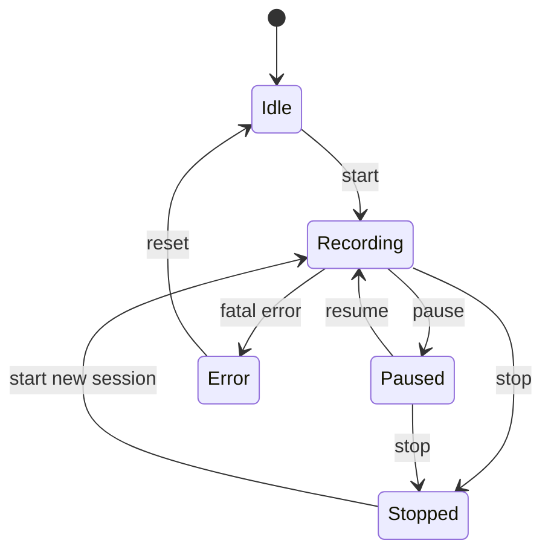

# 客户端详细设计（Qwen3.5-0.8B 本地摘要版）

## 1. 文档目标

本文档描述屏幕活动记录系统客户端的工程化详细设计。客户端负责在用户本地设备上完成屏幕采集、活动窗口采集、隐私过滤、Qwen3.5-0.8B 模型调用、本地缓存、同步上传和用户交互。

本系统的 Web/服务端会接入 DeepSeek V4 API 做日报级深度分析，但该能力不在客户端直接实现。客户端只上传经过本地模型摘要和隐私脱敏后的结构化活动记录，不上传原始截图和 OCR 全文，也不保存或使用 DeepSeek API Key。

客户端设计核心原则：

1. 用户明确开启后才记录。
2. 运行状态始终可见。
3. 用户可随时暂停和停止。
4. 默认不上传原始截图。
5. 默认不上传 OCR 原文。
6. 屏幕摘要在本地通过 Qwen3.5-0.8B 完成。
7. 网络异常不丢数据。
8. 模型异常不影响基本记录能力。

---

## 1.1 当前实现对齐（截至 2026-07-03）

当前 Windows 客户端实现位于 `desktop-client/`：

1. 技术栈为 Electron + React + TypeScript + better-sqlite3 + electron-log。
2. 本地数据库由 better-sqlite3 创建，默认位于 Electron `userData/data/activity_daily_client.db`，不是项目目录固定路径。
3. 默认模型 Provider 为 `transformers`，模型服务地址 `http://127.0.0.1:8001/v1`，模型路径 `local-models/ollama/Qwen3.5-0.8B`。
4. `start-client.cmd` 会调用 `scripts/start-client.ps1`，检查环境、依赖和本地模型服务，必要时启动 Transformers 服务、Vite 渲染服务和 Electron；启动成功后 cmd 窗口自动退出。
5. 客户端点击右上角关闭按钮时会询问“后台运行 / 直接退出 / 取消”，后台运行可通过系统托盘重新打开。
6. 记录中默认不上传原始截图，上传窗口标题默认为关闭；服务端地址、模型参数、采集间隔等保存在本地 SQLite 设置表。
7. 当前 Token 存储在本地 SQLite 设置表中；系统 Keychain 存储属于后续增强。

---

## 2. 客户端技术栈

| 模块 | 技术 |
|---|---|
| 桌面框架 | Electron |
| UI | React + TypeScript |
| 本地数据库 | SQLite |
| 本地模型接入 | Transformers / OpenAI-compatible；兼容 Ollama / Local HTTP Adapter |
| 日志 | pino / electron-log |
| 配置存储 | SQLite + JSON |
| Token 存储 | 当前存入本地 SQLite 设置表；系统 Keychain 为后续增强 |
| 打包 | electron-builder |

---

## 3. 客户端目录结构

```text
desktop-client/
├── src/
│   ├── main/
│   │   ├── app.ts
│   │   ├── tray.ts
│   │   ├── window.ts
│   │   ├── ipc.ts
│   │   ├── permissions.ts
│   │   ├── capture/
│   │   │   ├── CaptureService.ts
│   │   │   ├── CaptureProvider.ts
│   │   │   ├── WindowsCaptureProvider.ts
│   │   │   ├── MacCaptureProvider.ts
│   │   │   └── LinuxCaptureProvider.ts
│   │   ├── active-window/
│   │   │   ├── ActiveWindowService.ts
│   │   │   ├── ActiveWindowProvider.ts
│   │   │   ├── WindowsActiveWindowProvider.ts
│   │   │   ├── MacActiveWindowProvider.ts
│   │   │   └── LinuxActiveWindowProvider.ts
│   │   ├── scheduler/
│   │   │   ├── RecordScheduler.ts
│   │   │   └── IdleDetector.ts
│   │   ├── privacy/
│   │   │   ├── PrivacyService.ts
│   │   │   ├── PrivacyRuleEngine.ts
│   │   │   └── Sanitizer.ts
│   │   ├── model-adapter/
│   │   │   ├── ModelAdapter.ts
│   │   │   ├── OllamaAdapter.ts
│   │   │   ├── LocalHttpAdapter.ts
│   │   │   ├── PromptBuilder.ts
│   │   │   └── ModelOutputParser.ts
│   │   ├── storage/
│   │   │   ├── LocalDatabase.ts
│   │   │   ├── ActivityRecordRepository.ts
│   │   │   ├── SessionRepository.ts
│   │   │   └── SettingsRepository.ts
│   │   ├── sync/
│   │   │   ├── SyncService.ts
│   │   │   ├── SyncQueue.ts
│   │   │   └── ApiClient.ts
│   │   └── logs/
│   │       └── logger.ts
│   ├── renderer/
│   │   ├── index.html
│   │   ├── main.tsx
│   │   ├── styles.css
│   │   └── vite-env.d.ts
│   └── shared/
│       ├── types.ts
│       ├── constants.ts
│       └── ipcChannels.ts
```

---

## 4. 进程职责划分

### 4.1 主进程

主进程负责所有系统级能力：

1. 屏幕采集。
2. 活动窗口采集。
3. 权限检测。
4. 托盘状态。
5. 本地模型调用。
6. SQLite 读写。
7. 同步队列。
8. 日志。
9. 系统通知。

### 4.2 渲染进程

渲染进程负责 UI：

1. 展示记录状态。
2. 开始、暂停、停止按钮。
3. 模型状态展示。
4. 同步状态展示。
5. 隐私规则设置。
6. 本地记录列表。
7. 登录和服务端配置。
8. 打开 Web 日报入口。

### 4.3 IPC 通信

推荐 IPC Channel：

| Channel | 方向 | 说明 |
|---|---|---|
| recorder:start | renderer -> main | 开始记录 |
| recorder:pause | renderer -> main | 暂停记录 |
| recorder:resume | renderer -> main | 恢复记录 |
| recorder:stop | renderer -> main | 停止记录 |
| recorder:status | renderer -> main | 获取状态 |
| model:health | renderer -> main | 检查模型状态 |
| sync:run | renderer -> main | 手动同步 |
| settings:get | renderer -> main | 读取配置 |
| settings:update | renderer -> main | 更新配置 |
| records:list | renderer -> main | 查询本地记录 |

---

## 5. 记录状态机



状态定义：

| 状态 | 说明 |
|---|---|
| Idle | 客户端已启动，未记录 |
| Recording | 正在记录 |
| Paused | 用户主动暂停 |
| Stopped | 当前会话结束 |
| Error | 严重异常 |

状态约束：

1. Paused 状态不得截图。
2. Stopped 状态不得继续写入当前 session。
3. Error 状态必须停止调度器。
4. Recording 状态必须显示托盘提示。

---

## 6. 屏幕采集设计

### 6.1 CaptureProvider 接口

```ts
interface CaptureProvider {
  checkPermission(): Promise<PermissionStatus>;
  capturePrimaryScreen(): Promise<CaptureFrame>;
  captureActiveScreen(activeWindow: ActiveWindowInfo): Promise<CaptureFrame>;
}
```

### 6.2 CaptureFrame

```ts
interface CaptureFrame {
  frameId: string;
  capturedAt: string;
  displayId?: string;
  width: number;
  height: number;
  imageBase64?: string;
  imageBuffer?: Buffer;
  source: "primary_monitor" | "active_monitor" | "all_monitors";
}
```

### 6.3 采集频率

默认配置：

```json
{
  "capture_interval_seconds": 30,
  "min_capture_interval_seconds": 10,
  "max_capture_interval_seconds": 300,
  "capture_mode": "interval_and_event",
  "max_image_long_edge": 1280
}
```

触发场景：

1. 定时触发。
2. 应用切换触发。
3. 窗口标题变化触发。
4. 空闲恢复触发。

---

## 7. 活动窗口采集设计

### 7.1 ActiveWindowProvider 接口

```ts
interface ActiveWindowProvider {
  getActiveWindow(): Promise<ActiveWindowInfo>;
}
```

### 7.2 ActiveWindowInfo

```ts
interface ActiveWindowInfo {
  appName?: string;
  processName?: string;
  windowTitle?: string;
  windowId?: string;
  displayId?: string;
  capturedAt: string;
}
```

### 7.3 平台实现

| 平台 | 实现 |
|---|---|
| Windows | Win32 API 获取前台窗口、进程、标题 |
| macOS | Accessibility API / AppleScript |
| Linux | X11 使用 xdotool / wmctrl，Wayland 后续适配 |

---

## 8. 空闲检测设计

默认空闲阈值：5 分钟。

```ts
interface IdleState {
  isIdle: boolean;
  idleSeconds: number;
  changedAt: string;
}
```

处理规则：

1. 从非空闲进入空闲：结束当前活动片段。
2. 空闲中：不截图，不调用模型，只累计空闲时间。
3. 从空闲恢复：立即采集一次，开启新片段。

---

## 9. 隐私过滤设计

### 9.1 PrivacyService

```ts
class PrivacyService {
  shouldSkipCapture(info: ActiveWindowInfo): PrivacyDecision;
  sanitizeWindowTitle(title?: string): string | undefined;
  sanitizeOcrText(text?: string): string | undefined;
  sanitizeSummary(summary: string): string;
  sanitizeBeforeUpload(record: ActivityRecord): ActivityRecord;
}
```

### 9.2 PrivacyDecision

```ts
interface PrivacyDecision {
  action: "allow" | "skip" | "private_duration" | "app_only";
  reason?: string;
  matchedRule?: string;
}
```

### 9.3 默认黑名单

```json
{
  "app_blacklist": ["1Password", "Bitwarden", "KeePass", "银行", "支付宝"],
  "keyword_blacklist": ["密码", "验证码", "身份证", "银行卡", "token", "secret", "api key"]
}
```

### 9.4 上传前字段控制

默认上传：

```json
{
  "start_time": true,
  "end_time": true,
  "duration_seconds": true,
  "summary": true,
  "category": true,
  "confidence": true,
  "privacy_level": true,
  "app_name": true,
  "window_title": false,
  "raw_screenshot": false,
  "ocr_text": false
}
```

---

## 10. Qwen3.5-0.8B 模型适配层

### 10.1 ModelAdapter 接口

```ts
interface ModelAdapter {
  healthCheck(): Promise<ModelHealth>;
  summarize(input: ScreenSummaryInput): Promise<ModelSummary>;
}
```

### 10.2 ModelHealth

```ts
interface ModelHealth {
  status: "ok" | "unavailable" | "error";
  provider: "ollama" | "local_http" | "transformers";
  modelName: string;
  supportsImage: boolean;
  message?: string;
}
```

### 10.3 ScreenSummaryInput

```ts
interface ScreenSummaryInput {
  requestId: string;
  timestamp: string;
  appName?: string;
  windowTitle?: string;
  imageBase64?: string;
  ocrText?: string;
  previousSummary?: string;
  recentContext?: RecentActivity[];
}
```

### 10.4 ModelSummary

```ts
interface ModelSummary {
  requestId: string;
  summary: string;
  category: ActivityCategory;
  confidence: number;
  sensitive: boolean;
  reason?: string;
}
```

### 10.5 PromptBuilder

PromptBuilder 负责构造 Qwen3.5-0.8B 专用提示词，约束输出 JSON、中文摘要、固定类别和敏感信息过滤。

### 10.6 ModelOutputParser

职责：

1. 提取 JSON。
2. 校验字段。
3. 修复常见格式错误。
4. 校验 category 是否在枚举中。
5. 校验 confidence 范围。
6. 对 summary 二次脱敏。
7. 失败时返回兜底结果。

### 10.7 模型调用参数

```json
{
  "temperature": 0.2,
  "top_p": 0.8,
  "max_tokens": 256,
  "timeout_seconds": 30
}
```

---

## 11. 活动片段生成设计

### 11.1 ActivityRecord

```ts
interface ActivityRecord {
  id: string;
  userId?: string;
  deviceId: string;
  sessionId: string;
  startTime: string;
  endTime: string;
  durationSeconds: number;
  appName?: string;
  windowTitle?: string;
  processName?: string;
  summary: string;
  category: ActivityCategory;
  confidence?: number;
  privacyLevel: "normal" | "private" | "redacted";
  uploadStatus: "pending" | "uploading" | "synced" | "failed" | "ignored";
  retryCount: number;
  createdAt: string;
  updatedAt: string;
}
```

### 11.2 合并条件

1. 时间间隔不超过 90 秒。
2. 类别相同。
3. 应用相同。
4. 摘要相似。
5. 隐私等级相同。
6. 未跨越暂停、停止、空闲边界。

---

## 12. SQLite 本地表结构

### 12.1 local_activity_records

```sql
CREATE TABLE local_activity_records (
    id TEXT PRIMARY KEY,
    user_id TEXT,
    device_id TEXT NOT NULL,
    session_id TEXT NOT NULL,
    start_time TEXT NOT NULL,
    end_time TEXT NOT NULL,
    duration_seconds INTEGER NOT NULL,
    app_name TEXT,
    window_title TEXT,
    process_name TEXT,
    summary TEXT NOT NULL,
    category TEXT,
    confidence REAL,
    privacy_level TEXT NOT NULL DEFAULT 'normal',
    upload_status TEXT NOT NULL DEFAULT 'pending',
    retry_count INTEGER NOT NULL DEFAULT 0,
    server_record_id TEXT,
    error_message TEXT,
    metadata TEXT,
    created_at TEXT NOT NULL,
    updated_at TEXT NOT NULL
);
```

### 12.2 local_sessions

```sql
CREATE TABLE local_sessions (
    id TEXT PRIMARY KEY,
    device_id TEXT NOT NULL,
    started_at TEXT NOT NULL,
    ended_at TEXT,
    status TEXT NOT NULL,
    created_at TEXT NOT NULL,
    updated_at TEXT NOT NULL
);
```

### 12.3 local_settings

```sql
CREATE TABLE local_settings (
    key TEXT PRIMARY KEY,
    value TEXT NOT NULL,
    updated_at TEXT NOT NULL
);
```

### 12.4 local_sync_logs

```sql
CREATE TABLE local_sync_logs (
    id TEXT PRIMARY KEY,
    started_at TEXT NOT NULL,
    ended_at TEXT,
    status TEXT NOT NULL,
    uploaded_count INTEGER DEFAULT 0,
    failed_count INTEGER DEFAULT 0,
    error_message TEXT
);
```

---

## 13. 同步队列设计

### 13.1 SyncService

```ts
class SyncService {
  startAutoSync(): void;
  stopAutoSync(): void;
  syncOnce(): Promise<SyncResult>;
}
```

### 13.2 同步流程

1. 检查用户登录状态。
2. 检查服务器地址。
3. 检查网络可用性。
4. 读取 pending 和 failed 记录。
5. 上传前执行隐私脱敏。
6. 按 batch_size 批量上传。
7. 根据服务端返回更新本地状态。
8. 失败时增加 retry_count。
9. 超过最大重试次数标记 failed。

默认参数：

```json
{
  "sync_interval_seconds": 60,
  "batch_size": 100,
  "max_retry_count": 5
}
```

---

## 14. UI 设计

### 14.1 主界面

展示：

1. 当前状态。
2. 本地模型状态。
3. 同步状态。
4. 今日记录时长。
5. 最近活动摘要。
6. 开始、暂停、停止、立即同步按钮。

### 14.2 设置页

配置：

1. 采集间隔。
2. 空闲阈值。
3. 多屏策略。
4. Qwen3.5-0.8B 模型地址。
5. Ollama 模型名称。
6. 隐私黑名单。
7. 上传字段控制。
8. 同步服务器地址。
9. 清空本地数据。

---

## 15. 异常处理

| 异常 | 处理 |
|---|---|
| 无屏幕权限 | 提示授权，不采集 |
| 模型未启动 | 降级，仅记录应用和时间 |
| 模型超时 | 使用上一条摘要或窗口标题兜底 |
| JSON 解析失败 | 尝试修复，失败则兜底 |
| SQLite 写入失败 | 停止记录并提示严重错误 |
| 网络不可用 | 本地缓存，等待下次同步 |
| Token 过期 | 自动刷新，失败则重新登录 |

---

## 16. 客户端验收标准

1. 可以启动、暂停、停止记录。
2. 可以连续记录 1 小时不崩溃。
3. 可以调用 Qwen3.5-0.8B 生成摘要。
4. 模型不可用时客户端不崩溃。
5. 默认不上传原始截图。
6. 命中隐私应用时不截图或只记录隐私时间。
7. 网络断开后记录保存在 SQLite。
8. 网络恢复后可以自动补传。
9. 用户可以查看最近本地记录。
10. 用户可以清空本地数据。

---

## 18. 与 DeepSeek V4 Web 分析的边界

### 18.1 客户端不直接调用 DeepSeek API

客户端只负责本地实时记录，不直接调用 DeepSeek V4 API。原因：

1. DeepSeek API Key 不应分发到用户电脑客户端中，避免泄露。
2. 客户端采集的是高敏感屏幕数据，不应将截图或 OCR 全文传给云端模型。
3. DeepSeek V4 的任务是对服务端已有的结构化活动记录做日报、周报和月报分析，不是实时屏幕识别。
4. 客户端需要在离线状态下仍能正常记录，不能依赖远程 AI 服务。

### 18.2 客户端上传给服务端的数据

客户端上传的数据必须是 Qwen3.5-0.8B 已经生成并通过隐私过滤的结构化记录。

允许上传：

```json
{
  "start_time": "2026-01-01T09:00:00+08:00",
  "end_time": "2026-01-01T09:10:00+08:00",
  "duration_seconds": 600,
  "summary": "编写后端接口代码",
  "category": "编程开发",
  "app_name": "Visual Studio Code",
  "confidence": 0.86,
  "privacy_level": "normal",
  "metadata": {
    "local_model_provider": "ollama",
    "local_model_name": "qwen3.5:0.8b"
  }
}
```

禁止上传：

1. 原始截图。
2. OCR 全文。
3. 键盘输入。
4. 鼠标轨迹。
5. 音频、摄像头内容。
6. 聊天全文、文档全文。
7. DeepSeek API Key 或任何云端模型密钥。

### 18.3 Web AI 分析触发后的客户端行为

用户在 Web 页面点击“生成 AI 分析”后，客户端无需参与。完整流程为：

```text
Web 前端
  ↓
后端 API
  ↓
读取服务端 activity_records
  ↓
服务端脱敏和压缩
  ↓
服务端调用 DeepSeek V4 API
  ↓
服务端保存 AI 分析结果
  ↓
Web 前端展示
```

客户端只需要保证上传的活动记录质量足够高，包括时间准确、摘要简短、分类稳定、隐私等级正确。

