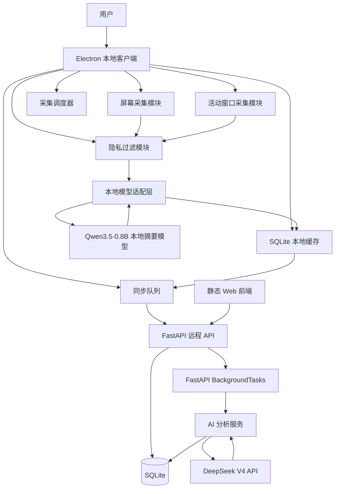
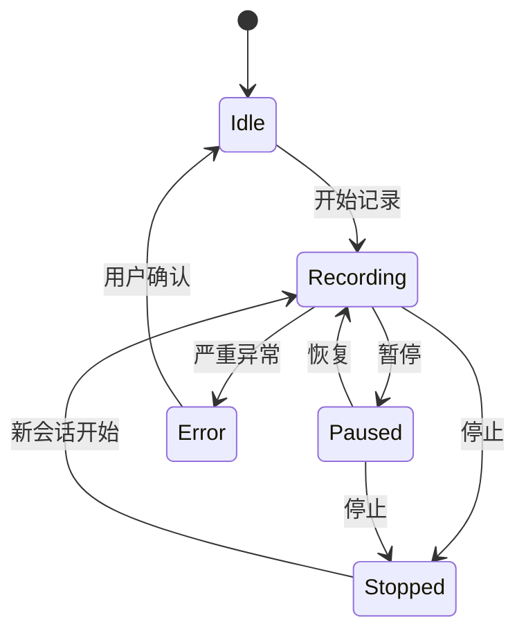

# 屏幕活动记录与日报生成系统技术方案设计书（Qwen3.5-0.8B + DeepSeek V4 API 版）

## 1. 文档信息

| 项目 | 内容 |
|---|---|
| 文档名称 | 屏幕活动记录与日报生成系统技术方案设计书 |
| 文档版本 | v1.2 |
| 修订说明 | 在 v1.1 基础上补充 Web/服务端 DeepSeek V4 API 分析能力，形成“客户端 Qwen3.5-0.8B 本地实时摘要 + 服务端 DeepSeek V4 日报深度分析”的双模型架构 |
| 适用对象 | 客户端工程师、后端工程师、前端工程师、算法工程师、测试工程师 |
| 核心原则 | 本地采集、本地推理、最小上传、透明运行、用户可控、隐私优先 |

---

## 1.1 当前实现对齐（截至 2026-07-03）

当前仓库实现的是单机 MVP：

1. 客户端：`desktop-client/`，Electron + React + TypeScript，主进程负责采集、模型调用、SQLite、本地同步队列和托盘；渲染进程提供登录、开始/暂停/停止、同步、模型检查、设置、本地记录等界面。
2. 本地模型服务：启动脚本优先使用 Transformers / OpenAI-compatible 服务加载 `local-models/ollama/Qwen3.5-0.8B`，并保留 Ollama / Local HTTP Adapter 兼容层。
3. 服务端：`server/app`，FastAPI + Python `sqlite3`，数据库为 SQLite 文件；异步 AI 分析使用 FastAPI `BackgroundTasks`，当前未使用 Redis/Celery。
4. Web：`web/`，原生静态 HTML/CSS/JavaScript，由 FastAPI 直接挂载；当前不是 React Web 工程。
5. AI Key：用户通过 Web 的 API 管理页保存 DeepSeek API Key；服务端不提供默认 Key。未保存 Key 时，前端提示配置，后端拒绝创建任务并返回 `API_KEY_REQUIRED`。
6. 部署：当前 Ubuntu 服务以 Uvicorn/systemd 运行在 `:8000`，HTTPS/Nginx 反向代理属于部署增强，尚未在仓库内固化。

---

## 2. 项目概述

本系统用于帮助用户自动记录自己一天在电脑上的活动。系统采用双模型架构：

1. **客户端本地模型：Qwen3.5-0.8B**。负责实时屏幕理解、短摘要生成、活动分类和隐私初步判断。该部分在本地完成，默认不上传原始截图和 OCR 原文。
2. **Web/服务端分析模型：DeepSeek V4 API**。负责对已上传的结构化活动记录进行日报级、周报级、月报级和深度复盘分析。Web 前端提供触发入口和结果展示，实际 API Key 和模型调用必须放在服务端，浏览器端不得直连 DeepSeek API。

本地客户端在用户明确开启后监控屏幕活动，定期采集屏幕画面、当前应用、窗口标题、用户空闲状态等信息，并调用本地部署的 Qwen3.5-0.8B 模型生成简短活动摘要。客户端将时间段、摘要、类别、置信度、隐私等级等结构化数据上传到远程服务器。远程服务器负责存储活动记录，先进行规则聚合，再根据用户请求或自动任务调用 DeepSeek V4 API 生成更自然、更完整的日报分析，最终通过 Web 页面展示。

本系统不做隐藏式监控，不绕过系统权限，不采集键盘输入、音频或摄像头。默认不上传原始截图，也不上传 OCR 原文。DeepSeek V4 API 只接收已经脱敏和聚合后的活动记录，不应接收原始截图、OCR 全文、聊天全文或文档全文。

---

## 3. 总体目标

### 3.1 功能目标

1. 本地客户端能够启动、暂停、停止屏幕活动记录。
2. 本地客户端能够定时采集屏幕截图和活动窗口信息。
3. 本地客户端能够调用 Qwen3.5-0.8B 生成简短中文活动摘要。
4. 本地客户端能够对敏感应用、敏感窗口和敏感文本进行本地过滤。
5. 本地客户端能够将活动记录写入 SQLite 本地缓存。
6. 本地客户端能够在网络可用时批量上传活动记录。
7. 远程服务端能够接收、校验、去重并保存活动记录。
8. 远程服务端能够基于活动记录生成规则版日报。
9. Web 前端能够触发服务端 DeepSeek V4 API 分析，生成 AI 增强版日报、复盘建议和趋势总结。
10. Web 前端能够展示日报、时间线、分类统计、应用统计和 AI 分析结果。
11. 用户能够编辑、删除、导出活动记录和日报。

### 3.2 技术目标

1. 客户端、模型服务、后端、前端解耦。
2. Qwen3.5-0.8B 通过模型适配层接入，后续可替换其他模型。
3. 屏幕采集、隐私过滤、模型调用、上传同步均可配置。
4. 本地缓存支持断网续传。
5. 服务端接口具备幂等性。
6. 数据库支持后续周报、月报、多设备合并和项目统计扩展。
7. 日报生成逻辑采用“规则聚合 + DeepSeek V4 API 深度分析”的组合方式：规则层负责确定性统计，DeepSeek V4 负责自然语言总结、重点提炼和建议生成。
8. DeepSeek API Key 由用户在 Web API 管理页提交并保存在服务端，Web 前端不持久化、不回显明文；生产环境应进一步加密存储。

---

## 4. 推荐技术栈

| 层级 | 推荐技术 | 说明 |
|---|---|---|
| 桌面客户端 | Electron + React + TypeScript | 跨平台、开发速度快、便于接入屏幕采集和托盘 |
| 客户端本地数据库 | SQLite | 轻量、稳定、适合作为本地上传队列 |
| 本地模型 | Qwen3.5-0.8B | MVP 默认本地屏幕摘要模型 |
| 模型部署 | Transformers / OpenAI-compatible；保留 Ollama / Local HTTP Adapter | 当前启动脚本默认自动启动 Transformers 服务 |
| OCR | 当前不做 OCR，依赖本地视觉模型识图 | OCR 属于后续增强 |
| 后端服务 | FastAPI | API 清晰，Python 生态适合日报聚合 |
| 后端数据库 | SQLite | 当前 MVP 使用 sqlite3 文件数据库；PostgreSQL 为后续生产化选项 |
| 异步任务 | FastAPI BackgroundTasks | 当前 AI 分析后台任务实现；Redis/Celery 为后续扩展 |
| Web 前端 | 静态 HTML/CSS/JavaScript | 当前由 FastAPI 挂载，React Web 为后续重构选项 |
| Web/服务端 AI 分析 | DeepSeek V4 API | 默认 deepseek-v4-flash，复杂分析可选 deepseek-v4-pro |
| 图表 | ECharts / Recharts | 展示分类统计和应用统计 |
| 部署 | Docker Compose | 适合 MVP 单机服务器部署 |
| 反向代理 | 未内置；建议 Nginx / Caddy | 当前服务直接运行在 Uvicorn :8000，HTTPS 属于部署增强 |

---

## 5. 总体架构




### 5.1 架构说明

系统采用“本地客户端 + 本地模型适配层 + 远程服务端 + AI 分析服务 + Web 前端”的架构。

1. **本地客户端**：负责屏幕采集、窗口信息采集、隐私过滤、本地缓存和同步上传。
2. **本地模型适配层**：统一封装 Qwen3.5-0.8B 的调用细节，对客户端暴露稳定接口。
3. **远程服务端**：负责认证、设备管理、活动记录存储、规则聚合、DeepSeek V4 调用代理、日报生成和导出。
4. **AI 分析服务**：服务端内部模块，负责 prompt 组装、脱敏校验、DeepSeek V4 API 调用、结果解析、token 统计、失败重试和降级。
5. **Web 前端**：负责日报展示、编辑、删除、统计图表、AI 分析触发和分析结果展示。

---

## 6. 核心数据流

### 6.1 本地采集到上传流程

```text
用户点击开始记录
  ↓
创建本地 session
  ↓
定时器触发屏幕采集
  ↓
获取当前屏幕截图、应用名、窗口标题
  ↓
执行采集前隐私规则判断
  ↓
命中隐私规则：生成隐私时间段记录
  ↓
未命中隐私规则：截图压缩并传入本地模型适配层
  ↓
Qwen3.5-0.8B 生成 JSON 摘要
  ↓
客户端解析、脱敏、兜底修复
  ↓
生成活动片段并写入 SQLite
  ↓
同步队列批量上传到远程服务端
  ↓
服务端校验、去重、保存
  ↓
标记当日日报需要重新生成
```

### 6.2 日报生成与 DeepSeek V4 分析流程

```text
用户打开日报页面 / 新记录上传 / 用户手动重新生成
  ↓
服务端查询当日活动记录
  ↓
过滤已删除记录
  ↓
按时间排序
  ↓
合并相邻相似活动
  ↓
统计总时长、有效时长、空闲时长、隐私时长
  ↓
统计分类耗时和应用耗时
  ↓
提取重点活动
  ↓
生成规则版日报 JSON
  ↓
判断是否需要 AI 增强分析
  ↓
服务端对记录进行二次脱敏和压缩
  ↓
调用 DeepSeek V4 API
  ↓
解析 AI 分析结果：一句话总结 / 今日重点 / 时间线解释 / 复盘建议
  ↓
写入 daily_reports 与 ai_analysis_jobs 表
  ↓
前端渲染规则统计 + AI 分析内容
```

设计原则：规则聚合结果作为事实基线，DeepSeek V4 只负责自然语言分析和建议生成；当 DeepSeek API 不可用时，日报仍可展示规则版结果。

---

## 7. 客户端技术设计

### 7.1 客户端目录结构

```text
desktop-client/
├── src/
│   ├── main/
│   │   ├── app.ts
│   │   ├── tray.ts
│   │   ├── window.ts
│   │   ├── permissions.ts
│   │   ├── capture/
│   │   ├── active-window/
│   │   ├── scheduler/
│   │   ├── privacy/
│   │   ├── model-adapter/
│   │   ├── storage/
│   │   ├── sync/
│   │   └── logs/
│   ├── renderer/
│   │   ├── index.html
│   │   ├── main.tsx
│   │   ├── styles.css
│   │   └── vite-env.d.ts
│   └── shared/
│       ├── types.ts
│       └── constants.ts
```

### 7.2 客户端状态机



| 状态 | 说明 |
|---|---|
| Idle | 客户端启动但未开始记录 |
| Recording | 正在采集并生成摘要 |
| Paused | 用户主动暂停，不采集任何屏幕内容 |
| Stopped | 当前记录会话结束 |
| Error | 发生严重错误，例如数据库不可写 |

### 7.3 屏幕采集策略

MVP 使用“定时采集 + 事件触发”的混合策略。

| 触发方式 | 默认策略 |
|---|---|
| 定时采集 | 每 30 秒一次 |
| 应用切换 | 立即采集一次 |
| 窗口标题变化 | 立即采集一次 |
| 空闲恢复 | 立即采集一次 |
| 空闲状态 | 不截图，只累计空闲时长 |

默认配置：

```json
{
  "capture_interval_seconds": 30,
  "idle_threshold_seconds": 300,
  "multi_monitor_mode": "active_monitor",
  "max_image_long_edge": 1280,
  "save_screenshot": false
}
```

### 7.4 多屏策略

| 模式 | 说明 | MVP |
|---|---|---|
| active_monitor | 仅采集当前活动窗口所在屏幕 | 是 |
| primary_monitor | 仅采集主屏 | 是 |
| all_monitors | 采集全部屏幕 | 后续支持 |

MVP 默认使用 `active_monitor`，以降低隐私风险和模型输入成本。

### 7.5 隐私过滤层级

隐私过滤分为四层：

```text
采集前过滤
  ↓
模型调用前过滤
  ↓
模型输出后过滤
  ↓
上传前过滤
```

默认隐私配置：

```json
{
  "upload_raw_screenshot": false,
  "upload_ocr_text": false,
  "upload_window_title": false,
  "privacy_app_blacklist": [
    "1Password",
    "Bitwarden",
    "KeePass",
    "银行",
    "支付宝"
  ],
  "privacy_title_keywords": [
    "密码",
    "验证码",
    "身份证",
    "银行卡",
    "token",
    "secret",
    "private key",
    "api key"
  ]
}
```

命中隐私规则后的默认处理：

```json
{
  "summary": "隐私内容，已跳过分析",
  "category": "隐私",
  "privacy_level": "private",
  "app_name": null,
  "window_title": null
}
```

---

## 8. 本地模型方案：Qwen3.5-0.8B

### 8.1 模型定位

Qwen3.5-0.8B 在本系统中定位为“本地轻量级屏幕活动摘要模型”。它主要承担当前屏幕的粗粒度理解、简短摘要生成和活动分类，不承担复杂日报长文生成。

适合承担：

1. 单帧屏幕活动理解。
2. 10 到 40 字中文摘要生成。
3. 活动类别判断。
4. 粗粒度隐私判断。
5. 低成本本地推理。

不建议承担：

1. 长篇日报生成。
2. 多小时活动深度推理。
3. 高精度 OCR 替代。
4. 用户行为评价。
5. 隐私判断的唯一依据。

### 8.2 推荐部署方式

MVP 推荐优先支持两种方式：

| 方式 | 说明 | 优先级 |
|---|---|---|
| Ollama | 使用 `qwen3.5:0.8b`，部署简单 | P0 |
| 本地 HTTP Adapter | 封装 Transformers / llama.cpp / SGLang | P1 |

Ollama 配置示例：

```json
{
  "model": {
    "provider": "ollama",
    "base_url": "http://127.0.0.1:11434",
    "model_name": "qwen3.5:0.8b",
    "timeout_seconds": 30,
    "supports_image": true,
    "temperature": 0.2,
    "top_p": 0.8,
    "max_tokens": 256
  }
}
```

### 8.3 模型适配层

客户端不直接写死 Ollama 接口，而是调用本地模型适配层。

```text
Electron 客户端
  ↓
Local Model Adapter
  ↓
Ollama / Transformers / llama.cpp / SGLang
  ↓
Qwen3.5-0.8B
```

适配层职责：

1. 检查模型健康状态。
2. 统一请求格式。
3. 统一响应格式。
4. 管理提示词。
5. 控制推理参数。
6. 处理模型超时。
7. 修复或兜底非法 JSON。
8. 屏蔽不同部署方式的接口差异。

### 8.4 模型健康检查接口

```http
GET /health
```

响应：

```json
{
  "status": "ok",
  "provider": "ollama",
  "model_name": "qwen3.5:0.8b",
  "supports_image": true,
  "model_loaded": true
}
```

### 8.5 屏幕摘要接口

```http
POST /v1/screen-summary
Content-Type: application/json
```

请求：

```json
{
  "request_id": "req_20260101_090000",
  "timestamp": "2026-01-01T09:00:00+08:00",
  "app_name": "Visual Studio Code",
  "window_title": "main.py",
  "image_base64": "base64 image data",
  "ocr_text": "可选 OCR 文本，必须先脱敏",
  "previous_summary": "查看项目需求文档",
  "recent_context": [
    {
      "start_time": "08:55",
      "end_time": "09:00",
      "summary": "查看项目需求文档"
    }
  ]
}
```

响应：

```json
{
  "request_id": "req_20260101_090000",
  "summary": "编写 Python 后端接口代码",
  "category": "编程开发",
  "confidence": 0.86,
  "sensitive": false,
  "reason": "屏幕显示代码编辑器和 Python 代码"
}
```

### 8.6 Qwen3.5-0.8B 专用提示词

```text
你是一个本地屏幕活动总结助手。你需要根据当前屏幕截图、应用名称、窗口标题和最近上下文，判断用户正在做什么。

请严格遵守以下要求：
1. 只输出 JSON，不要输出 Markdown，不要输出解释。
2. summary 使用中文。
3. summary 长度控制在 10 到 40 个中文字符。
4. summary 描述用户正在做的事情，不要评价用户。
5. 不要复述大段屏幕文字。
6. 不要输出密码、验证码、身份证号、银行卡号、手机号、邮箱、Token、API Key 等敏感信息。
7. 如果屏幕内容疑似包含隐私内容，sensitive 设为 true，summary 输出“隐私内容，已跳过分析”。
8. category 必须从以下类别中选择：编程开发、文档写作、论文阅读、数据分析、模型训练、会议沟通、信息检索、娱乐休息、系统操作、空闲、隐私、其他。
9. 如果无法判断，summary 输出“使用电脑，具体内容不明确”，category 输出“其他”。
10. confidence 范围为 0 到 1。

输出 JSON 格式：
{
  "summary": "...",
  "category": "...",
  "confidence": 0.0,
  "sensitive": false,
  "reason": "..."
}
```

### 8.7 推理参数

```json
{
  "temperature": 0.2,
  "top_p": 0.8,
  "max_tokens": 256
}
```

如果 JSON 稳定性不足，调整为：

```json
{
  "temperature": 0.0,
  "top_p": 0.7,
  "max_tokens": 256
}
```

### 8.8 性能控制

1. 截图最长边缩放至 1280。
2. 空闲状态不调用模型。
3. 应用和窗口标题未变化时可降低调用频率。
4. 连续相似画面不重复调用模型。
5. 隐私应用直接跳过模型调用。
6. 模型连续失败时进入降级模式。
7. 限制单次模型调用超时时间为 30 秒。

### 8.9 降级策略

| 场景 | 降级方式 |
|---|---|
| 模型未启动 | 仅记录应用名称、窗口标题和时间段 |
| 模型超时 | 使用上一条摘要或窗口标题兜底 |
| 模型输出非法 JSON | 尝试修复，失败则使用兜底摘要 |
| 模型连续失败 | 暂停模型调用并提示用户 |
| 机器性能不足 | 降低采集频率，关闭 OCR |

兜底摘要示例：

```text
使用 Visual Studio Code
查看 Chrome 页面
使用 Terminal
隐私内容，已跳过分析
```

---

## 9. 活动记录生成与合并

### 9.1 活动记录结构

```ts
interface ActivityRecord {
  id: string;
  userId: string;
  deviceId: string;
  sessionId: string;
  startTime: string;
  endTime: string;
  durationSeconds: number;
  appName?: string;
  windowTitle?: string;
  processName?: string;
  summary: string;
  category: string;
  confidence?: number;
  privacyLevel: "normal" | "private" | "redacted";
  uploadStatus: "pending" | "uploading" | "synced" | "failed" | "ignored";
  createdAt: string;
  updatedAt: string;
}
```

### 9.2 合并规则

相邻记录满足以下条件时可以合并：

1. 时间间隔小于等于 90 秒。
2. 类别相同。
3. 应用名称相同或相近。
4. 摘要关键词相似。
5. 隐私等级相同。
6. 不跨越暂停、停止、空闲边界。

规则相似度：

```text
score = 0
category 相同 +0.4
app_name 相同 +0.3
window_title 相同或包含关系 +0.2
summary 关键词重叠 +0.1
score >= 0.75 可合并
```

---

## 10. 客户端本地数据库设计

### 10.1 local_activity_records

```sql
CREATE TABLE local_activity_records (
    id TEXT PRIMARY KEY,
    user_id TEXT,
    device_id TEXT NOT NULL,
    session_id TEXT NOT NULL,

    start_time TEXT NOT NULL,
    end_time TEXT NOT NULL,
    duration_seconds INTEGER NOT NULL,

    app_name TEXT,
    window_title TEXT,
    process_name TEXT,

    summary TEXT NOT NULL,
    category TEXT,
    confidence REAL,

    privacy_level TEXT NOT NULL DEFAULT 'normal',
    upload_status TEXT NOT NULL DEFAULT 'pending',
    retry_count INTEGER NOT NULL DEFAULT 0,

    server_record_id TEXT,
    error_message TEXT,
    metadata TEXT,

    created_at TEXT NOT NULL,
    updated_at TEXT NOT NULL
);

CREATE INDEX idx_local_activity_upload_status
ON local_activity_records(upload_status);

CREATE INDEX idx_local_activity_time
ON local_activity_records(start_time, end_time);
```

### 10.2 local_sessions

```sql
CREATE TABLE local_sessions (
    id TEXT PRIMARY KEY,
    device_id TEXT NOT NULL,
    started_at TEXT NOT NULL,
    ended_at TEXT,
    status TEXT NOT NULL,
    created_at TEXT NOT NULL,
    updated_at TEXT NOT NULL
);
```

### 10.3 local_settings

```sql
CREATE TABLE local_settings (
    key TEXT PRIMARY KEY,
    value TEXT NOT NULL,
    updated_at TEXT NOT NULL
);
```

---

## 11. 同步队列设计

### 11.1 同步流程

```text
定时触发同步
  ↓
检查登录状态
  ↓
检查网络状态
  ↓
读取 pending / failed 记录
  ↓
按 batch_size 分批
  ↓
上传服务端
  ↓
成功：标记 synced
  ↓
失败：retry_count + 1
  ↓
超过最大重试次数：标记 failed
```

### 11.2 默认参数

| 参数 | 默认值 |
|---|---:|
| 自动同步间隔 | 60 秒 |
| 每批最大记录数 | 100 条 |
| 最大重试次数 | 5 次 |
| 初始重试间隔 | 10 秒 |
| 最大重试间隔 | 10 分钟 |

### 11.3 幂等设计

客户端每条记录生成稳定的 `client_record_id`。服务端使用如下唯一约束防止重复：

```text
user_id + device_id + client_record_id
```

---

## 12. 服务端技术设计

### 12.1 服务端目录结构

当前服务端保持轻量扁平结构，便于 Ubuntu 单机部署和直接用 `uvicorn server.app.main:app` 启动：

```text
server/
└── app/
    ├── __init__.py
    ├── main.py       FastAPI 应用、路由、静态 Web 挂载
    ├── config.py     环境变量与路径配置
    ├── database.py   SQLite 连接、建表和补齐迁移
    ├── security.py   密码哈希、JWT 生成与校验
    └── services.py   认证、记录、日报、AI 分析等业务函数
```

未实现的生产化拆分项包括 `api/` 路由包、`schemas/`、`models/`、Alembic 迁移、独立 Worker 和 Redis/Celery。

### 12.2 服务端模块职责

| 模块 | 职责 |
|---|---|
| `main.py` | FastAPI 路由、依赖解析、静态 Web 页面入口、BackgroundTasks 调度 |
| `config.py` | `APP_DATA_DIR`、SQLite 路径、DeepSeek 地址/模型/超时配置 |
| `database.py` | SQLite 初始化、索引创建、轻量表结构补齐 |
| `security.py` | 密码哈希、访问令牌、刷新令牌 |
| `services.py` | 用户、设备、活动记录、规则日报、用户 API Key、DeepSeek 调用与任务落库 |

---

## 13. 服务端数据库设计概要

### 13.1 users

```sql
CREATE TABLE users (
    id UUID PRIMARY KEY,
    email VARCHAR(255) NOT NULL UNIQUE,
    username VARCHAR(100) NOT NULL,
    password_hash TEXT NOT NULL,
    timezone VARCHAR(64) NOT NULL DEFAULT 'Asia/Shanghai',
    status VARCHAR(32) NOT NULL DEFAULT 'active',
    created_at TIMESTAMP WITH TIME ZONE NOT NULL,
    updated_at TIMESTAMP WITH TIME ZONE NOT NULL,
    last_login_at TIMESTAMP WITH TIME ZONE
);
```

### 13.2 devices

```sql
CREATE TABLE devices (
    id UUID PRIMARY KEY,
    user_id UUID NOT NULL REFERENCES users(id),
    device_name VARCHAR(255) NOT NULL,
    os_type VARCHAR(64) NOT NULL,
    os_version VARCHAR(128),
    client_version VARCHAR(64),
    status VARCHAR(32) NOT NULL DEFAULT 'active',
    first_seen_at TIMESTAMP WITH TIME ZONE NOT NULL,
    last_seen_at TIMESTAMP WITH TIME ZONE,
    created_at TIMESTAMP WITH TIME ZONE NOT NULL,
    updated_at TIMESTAMP WITH TIME ZONE NOT NULL
);
```

### 13.3 activity_records

```sql
CREATE TABLE activity_records (
    id UUID PRIMARY KEY,
    user_id UUID NOT NULL REFERENCES users(id),
    device_id UUID NOT NULL REFERENCES devices(id),
    client_record_id VARCHAR(128) NOT NULL,
    session_id VARCHAR(128) NOT NULL,
    start_time TIMESTAMP WITH TIME ZONE NOT NULL,
    end_time TIMESTAMP WITH TIME ZONE NOT NULL,
    duration_seconds INTEGER NOT NULL,
    app_name VARCHAR(255),
    window_title TEXT,
    process_name VARCHAR(255),
    summary TEXT NOT NULL,
    category VARCHAR(64),
    confidence DOUBLE PRECISION,
    privacy_level VARCHAR(32) NOT NULL DEFAULT 'normal',
    source VARCHAR(32) NOT NULL DEFAULT 'client',
    metadata JSONB,
    is_deleted BOOLEAN NOT NULL DEFAULT FALSE,
    deleted_at TIMESTAMP WITH TIME ZONE,
    created_at TIMESTAMP WITH TIME ZONE NOT NULL,
    updated_at TIMESTAMP WITH TIME ZONE NOT NULL,
    UNIQUE(user_id, device_id, client_record_id)
);
```

### 13.4 daily_reports

```sql
CREATE TABLE daily_reports (
    id UUID PRIMARY KEY,
    user_id UUID NOT NULL REFERENCES users(id),
    report_date DATE NOT NULL,
    timezone VARCHAR(64) NOT NULL,
    title TEXT,
    overview TEXT,
    highlights JSONB,
    timeline JSONB,
    category_stats JSONB,
    app_stats JSONB,
    suggestions TEXT,
    user_note TEXT,
    total_tracked_seconds INTEGER NOT NULL DEFAULT 0,
    active_seconds INTEGER NOT NULL DEFAULT 0,
    idle_seconds INTEGER NOT NULL DEFAULT 0,
    private_seconds INTEGER NOT NULL DEFAULT 0,
    status VARCHAR(32) NOT NULL DEFAULT 'generated',
    is_stale BOOLEAN NOT NULL DEFAULT FALSE,
    generated_at TIMESTAMP WITH TIME ZONE,
    created_at TIMESTAMP WITH TIME ZONE NOT NULL,
    updated_at TIMESTAMP WITH TIME ZONE NOT NULL,
    UNIQUE(user_id, report_date)
);
```

---

## 14. API 设计概要

### 14.1 认证接口

```http
POST /api/v1/auth/register
POST /api/v1/auth/login
POST /api/v1/auth/refresh
```

### 14.2 设备接口

```http
POST /api/v1/devices
GET /api/v1/devices
PATCH /api/v1/devices/{device_id}
```

### 14.3 活动记录接口

```http
POST /api/v1/activity-records/batch
GET /api/v1/activity-records?date=2026-01-01&timezone=Asia/Shanghai
PATCH /api/v1/activity-records/{record_id}
DELETE /api/v1/activity-records/{record_id}
```

### 14.4 日报接口

```http
GET /api/v1/daily-reports/{date}
POST /api/v1/daily-reports/{date}/regenerate
PATCH /api/v1/daily-reports/{date}
GET /api/v1/daily-reports/{date}/export?format=markdown
POST /api/v1/daily-reports/{date}/ai-analysis
GET /api/v1/ai-analysis-jobs/{job_id}
```

---

## 15. 日报生成与 DeepSeek V4 API 分析方案

### 15.1 总体策略

日报采用“双层生成”策略：

1. **规则聚合层**：由服务端本地代码完成，负责事实统计、时间线合并、类别耗时、应用耗时、空闲时长、隐私时长等确定性结果。
2. **DeepSeek V4 分析层**：由服务端调用 DeepSeek V4 API 完成，负责自然语言总结、重点提炼、上下文解释、复盘建议和趋势洞察。

规则聚合层必须始终可用。DeepSeek V4 API 是增强能力，不应成为日报页面的唯一依赖。

### 15.2 模型选择

服务端配置项支持以下 DeepSeek V4 模型：

| 场景 | 推荐模型 | 说明 |
|---|---|---|
| 默认日报分析 | deepseek-v4-flash | 成本低、速度快，适合每天自动生成 |
| 用户手动深度复盘 | deepseek-v4-pro | 质量更高，适合复杂总结和长上下文分析 |
| 周报/月报 | deepseek-v4-pro 或 flash | 根据成本和质量要求配置 |
| 失败降级 | 规则模板 | API 不可用时使用规则版日报 |

### 15.3 为什么不能让浏览器直连 DeepSeek API

虽然用户看到的是 Web 端发起“AI 分析”，但实现上必须由后端代理调用 DeepSeek API，原因如下：

1. 浏览器端无法安全保存 DeepSeek API Key。
2. 直接在前端调用会暴露请求体和密钥。
3. 后端需要统一做脱敏、限流、审计和 token 统计。
4. 后端需要缓存分析结果，避免重复调用造成成本浪费。
5. 后端需要在 API 失败时提供降级结果。

正确链路：

```text
Web 前端点击“生成 AI 日报”
  ↓
后端校验用户权限
  ↓
后端查询活动记录
  ↓
后端脱敏、压缩、构造 prompt
  ↓
后端调用 DeepSeek V4 API
  ↓
后端解析 JSON 并保存
  ↓
Web 前端展示分析结果
```

### 15.4 DeepSeek API 配置

当前实现中，DeepSeek API Key 由用户在 Web 的 API 管理页配置，保存到服务端 SQLite 的 `user_api_keys` 表。服务端不提供默认 Key fallback；用户未配置时，AI 分析接口返回 `API_KEY_REQUIRED`。

服务端仍通过环境变量配置 DeepSeek 接入参数和模型名称：

```env
DEEPSEEK_BASE_URL=https://api.deepseek.com
DEEPSEEK_DEFAULT_MODEL=deepseek-v4-flash
DEEPSEEK_DEEP_ANALYSIS_MODEL=deepseek-v4-pro
DEEPSEEK_TIMEOUT_SECONDS=120
DEEPSEEK_MAX_RETRIES=2
```

配置说明：

| 配置项 | 说明 |
|---|---|
| DEEPSEEK_BASE_URL | DeepSeek API 地址 |
| DEEPSEEK_DEFAULT_MODEL | 默认日报分析模型 |
| DEEPSEEK_DEEP_ANALYSIS_MODEL | 深度分析模型 |
| DEEPSEEK_TIMEOUT_SECONDS | 单次分析超时时间 |
| DEEPSEEK_MAX_RETRIES | 最大重试次数 |

### 15.5 AI 分析输入数据

DeepSeek V4 API 的输入必须是结构化、脱敏、压缩后的活动记录，不允许包含原始截图和 OCR 全文。

允许输入：

```json
{
  "date": "2026-01-01",
  "timezone": "Asia/Shanghai",
  "overview_stats": {
    "total_tracked_seconds": 28800,
    "active_seconds": 24000,
    "idle_seconds": 3600,
    "private_seconds": 1200
  },
  "category_stats": [
    {"category": "编程开发", "duration_seconds": 10800},
    {"category": "论文阅读", "duration_seconds": 5400}
  ],
  "timeline": [
    {
      "start_time": "09:00",
      "end_time": "10:20",
      "category": "编程开发",
      "summary": "编写后端活动记录接口",
      "app_name": "Visual Studio Code"
    }
  ],
  "user_note": "可选用户备注"
}
```

禁止输入：

1. 原始截图。
2. OCR 原文全文。
3. 聊天记录全文。
4. 文档全文。
5. 密码、验证码、密钥、Token。
6. 身份证号、银行卡号、手机号、邮箱等未脱敏信息。

### 15.6 DeepSeek 分析输出结构

要求 DeepSeek V4 返回严格 JSON，结构如下：

```json
{
  "title": "今天主要进行了后端开发和论文阅读",
  "one_sentence_summary": "今天的主要投入集中在编程开发、论文阅读和文档整理。",
  "highlights": [
    "上午集中完成了后端活动记录接口开发。",
    "下午阅读了本地模型部署相关资料。"
  ],
  "timeline_commentary": [
    {
      "time_range": "09:00-10:20",
      "commentary": "这一时间段属于较连续的编程开发区间。"
    }
  ],
  "focus_analysis": {
    "focused_blocks": ["09:00-10:20"],
    "context_switching_notes": "下午存在一定资料检索和沟通切换。"
  },
  "suggestions": [
    "可以将资料检索集中到固定时间段，减少上下文切换。"
  ],
  "risk_flags": [
    "存在较长空闲时间，需要结合实际情况判断。"
  ]
}
```

### 15.7 DeepSeek 专用 Prompt 模板

```text
你是一个个人时间复盘助手。下面是用户一天的电脑活动记录，这些记录已经在本地完成屏幕摘要和隐私脱敏。

你的任务：
1. 基于事实记录生成客观日报分析。
2. 不要编造未发生的事情。
3. 不要进行心理诊断、绩效评价或道德评价。
4. 不要输出任何敏感原文。
5. 不要把“隐私时间”展开猜测。
6. 输出严格 JSON，不要输出 Markdown。

输入包括：
- 日期
- 总时长统计
- 分类耗时
- 应用耗时
- 合并后的时间线
- 用户备注

请输出：
{
  "title": "...",
  "one_sentence_summary": "...",
  "highlights": ["..."],
  "timeline_commentary": [
    {"time_range": "...", "commentary": "..."}
  ],
  "focus_analysis": {
    "focused_blocks": ["..."],
    "context_switching_notes": "..."
  },
  "suggestions": ["..."],
  "risk_flags": ["..."]
}
```

### 15.8 AI 分析任务状态

DeepSeek 调用应作为异步任务执行，避免阻塞日报页面。

任务状态：

| 状态 | 说明 |
|---|---|
| pending | 待执行 |
| running | 正在调用 DeepSeek API |
| succeeded | 分析成功 |
| failed | 分析失败 |
| fallback | 使用规则版降级结果 |

### 15.9 失败降级

| 失败场景 | 处理方式 |
|---|---|
| DeepSeek API 超时 | 返回规则版日报，任务标记 failed |
| DeepSeek API 限流 | 延迟重试，超过次数后降级 |
| JSON 解析失败 | 尝试修复，失败后降级 |
| 内容安全或脱敏校验失败 | 不调用 API，返回规则版结果 |
| 余额不足或认证失败 | 后台告警，前端显示 AI 分析暂不可用 |

### 15.10 成本控制

1. 默认使用 `deepseek-v4-flash` 自动生成日报。
2. `deepseek-v4-pro` 只用于用户手动点击“深度分析”或周报/月报。
3. 对相同日期、相同输入 hash 的分析结果进行缓存。
4. 活动记录变更后才重新生成 AI 分析。
5. 限制单用户每日 AI 重新生成次数。
6. 记录 token 使用量，便于成本统计。

---

## 16. Web 前端设计概要

### 16.1 页面

| 页面 | 功能 |
|---|---|
| 登录页 | 用户登录、Token 保存 |
| 日报页 | 今日概览、重点活动、时间线、统计图表、AI 分析入口 |
| 日历页 | 查看历史日报 |
| 设置页 | 用户信息、设备、导出、删除数据 |

### 16.2 日报页结构

```text
日期选择器 / 重新生成规则日报 / 生成 AI 分析 / 深度复盘 / 导出
  ↓
AI 一句话总结 / 规则一句话总结
  ↓
总记录时长 / 有效活动 / 空闲 / 隐私
  ↓
今日重点
  ↓
分类统计
  ↓
应用统计
  ↓
时间线
  ↓
用户备注
  ↓
DeepSeek V4 分析结果：重点、复盘、建议
```

---

## 17. 安全与隐私设计

### 17.1 透明运行

1. 客户端必须显示记录状态。
2. 系统托盘必须显示运行状态。
3. 用户必须可以随时暂停和停止。
4. 不允许隐藏式运行。
5. 首次启动必须展示隐私说明。

### 17.2 最小化上传

默认上传：

1. 时间段。
2. 摘要。
3. 类别。
4. 置信度。
5. 隐私等级。
6. 可选应用名称。

默认不上传：

1. 原始截图。
2. OCR 原文。
3. 键盘输入。
4. 鼠标轨迹。
5. 摄像头。
6. 麦克风。
7. 聊天全文。
8. 文档全文。

### 17.3 存储安全

客户端：

1. Token 当前存入本地 SQLite 设置表；系统 Keychain 为后续增强。
2. SQLite 可选加密。
3. 原始截图默认不落盘。
4. 日志不写敏感内容。

服务端：

1. 生产部署建议通过 Nginx / Caddy 提供 HTTPS；当前 FastAPI 服务自身未内置 HTTPS。
2. JWT 鉴权。
3. 密码强哈希。
4. 数据库最小权限。
5. 日志脱敏。
6. 用户只能访问自己的数据。

---

## 18. 部署方案

### 18.1 本地部署

用户电脑运行：

1. Electron 客户端。
2. Qwen3.5-0.8B 模型服务。
3. SQLite 本地数据库。

Ollama 示例：

```bash
ollama run qwen3.5:0.8b
```

### 18.2 服务端部署

服务器当前运行：

1. Uvicorn / FastAPI API 服务，可由 systemd 管理。
2. SQLite 数据库文件，通过 `APP_DATA_DIR` 或 `APP_DATABASE_PATH` 指定存储位置。
3. FastAPI 直接挂载 `web/` 静态前端。
4. Nginx / Caddy 可选用于域名、HTTPS 和反向代理。

Docker Compose 概要与当前仓库 `docker-compose.yml` 对齐：

```yaml
services:
  app:
    build: .
    container_name: activity-daily-app
    restart: unless-stopped
    env_file:
      - .env
    environment:
      APP_DATA_DIR: /app/data
    ports:
      - "8000:8000"
    volumes:
      - ./data:/app/data
```

---

### 18.4 DeepSeek API 服务端配置

DeepSeek API Key 不进入客户端和 Web 前端代码仓库。当前实现要求用户登录后在 API 管理页自行保存 Key；服务端仅保存并使用该用户自己的 Key。生产环境应补充 Key 加密存储或密钥管理服务。

服务端环境变量只负责 DeepSeek 地址、模型和超时等通用参数：

```env
DEEPSEEK_BASE_URL=https://api.deepseek.com
DEEPSEEK_DEFAULT_MODEL=deepseek-v4-flash
DEEPSEEK_DEEP_ANALYSIS_MODEL=deepseek-v4-pro
```

## 19. 测试方案

### 19.1 客户端测试

1. 开始、暂停、停止状态机测试。
2. 屏幕采集权限测试。
3. 活动窗口采集测试。
4. 隐私黑名单测试。
5. Qwen3.5-0.8B 模型调用测试。
6. 模型超时降级测试。
7. 模型非法 JSON 兜底测试。
8. SQLite 写入和读取测试。
9. 同步队列断网续传测试。

### 19.2 服务端测试

1. 注册登录测试。
2. Token 认证测试。
3. 设备归属测试。
4. 批量上传参数校验测试。
5. 幂等去重测试。
6. 活动记录查询测试。
7. 日报生成测试。
8. 编辑和删除记录测试。

### 19.3 隐私测试

1. 默认不上传原始截图。
2. 默认不上传 OCR 原文。
3. 命中密码管理器不调用模型。
4. 摘要中出现敏感字段时上传前脱敏。
5. 暂停状态不产生新记录。
6. 日志中无 Token、密码、截图内容。

---

## 20. 开发里程碑

### 第一阶段：本地采集与 Qwen3.5-0.8B 摘要闭环

1. 搭建 Electron 客户端。
2. 实现开始、暂停、停止。
3. 实现屏幕采集和活动窗口采集。
4. 实现隐私黑名单。
5. 实现 Qwen3.5-0.8B 模型适配层。
6. 实现摘要 JSON 解析和兜底。
7. 实现 SQLite 本地缓存。

验收：可以连续记录 1 小时，生成本地摘要，默认不上传截图。

### 第二阶段：服务端同步闭环

1. 搭建 FastAPI。
2. 实现认证和设备注册。
3. 实现活动记录批量上传。
4. 实现服务端 SQLite 表结构与启动初始化。
5. 实现幂等去重。
6. 实现客户端同步队列。

验收：断网不丢数据，网络恢复后可补传。

### 第三阶段：日报生成与 Web 展示

1. 实现日报聚合逻辑。
2. 实现日报查询接口。
3. 实现 React 日报页。
4. 实现时间线、分类统计、应用统计。

验收：用户可以查看当天日报。

### 第四阶段：编辑、删除、导出和隐私完善

1. 实现活动记录编辑。
2. 实现活动记录删除。
3. 实现日报重新生成。
4. 实现 Markdown 导出。
5. 完善日志脱敏和数据删除。

验收：用户可控制、可编辑、可删除自己的记录。

---

## 21. 工程化文档拆分边界

后续应将本技术方案拆分为三份更工程化的详细设计文档。

### 21.1 客户端详细设计.md

重点内容：

1. Electron 主进程与渲染进程划分。
2. 采集状态机。
3. 屏幕采集 Provider。
4. 活动窗口 Provider。
5. 隐私过滤规则引擎。
6. Qwen3.5-0.8B 模型适配层。
7. SQLite 本地表结构。
8. 同步队列。
9. 客户端配置项。
10. 客户端异常处理。

### 21.2 后端接口设计.md

重点内容：

1. API 通用响应格式。
2. 认证接口。
3. 设备接口。
4. 活动记录接口。
5. 日报接口。
6. 导出接口。
7. 错误码。
8. 权限校验。
9. 幂等设计。
10. 请求和响应示例。

### 21.3 数据库设计.md

重点内容：

1. 服务端 SQLite 表结构。
2. SQLite 本地表结构。
3. 字段说明。
4. 索引设计。
5. 唯一约束。
6. 软删除策略。
7. 数据保留策略。
8. 数据迁移方案。
9. 日报 JSON 字段结构。
10. 后续扩展字段。

---

## 22. 总结

本版本技术方案采用“双模型、双层日报”的架构：客户端默认使用 Qwen3.5-0.8B 进行本地屏幕活动轻量级摘要和分类；Web 端提供 AI 分析入口，但实际由服务端代理调用 DeepSeek V4 API，对已经脱敏和聚合后的结构化活动记录进行日报、周报、月报和深度复盘分析。

系统仍坚持本地优先和隐私优先：原始截图默认不上传，OCR 原文默认不上传，DeepSeek V4 API 不接收原始屏幕数据，API Key 不进入客户端或浏览器。规则版日报必须始终可用，DeepSeek V4 作为增强分析能力，在失败、限流或配置缺失时自动降级。

MVP 应优先完成“本地采集 → Qwen3.5-0.8B 本地摘要 → SQLite 缓存 → 批量上传 → 服务端存储 → 规则聚合日报 → DeepSeek V4 AI 分析 → Web 展示”的闭环。在此基础上，再逐步扩展周报、月报、项目统计、多设备合并、浏览器插件和本地日报生成。
