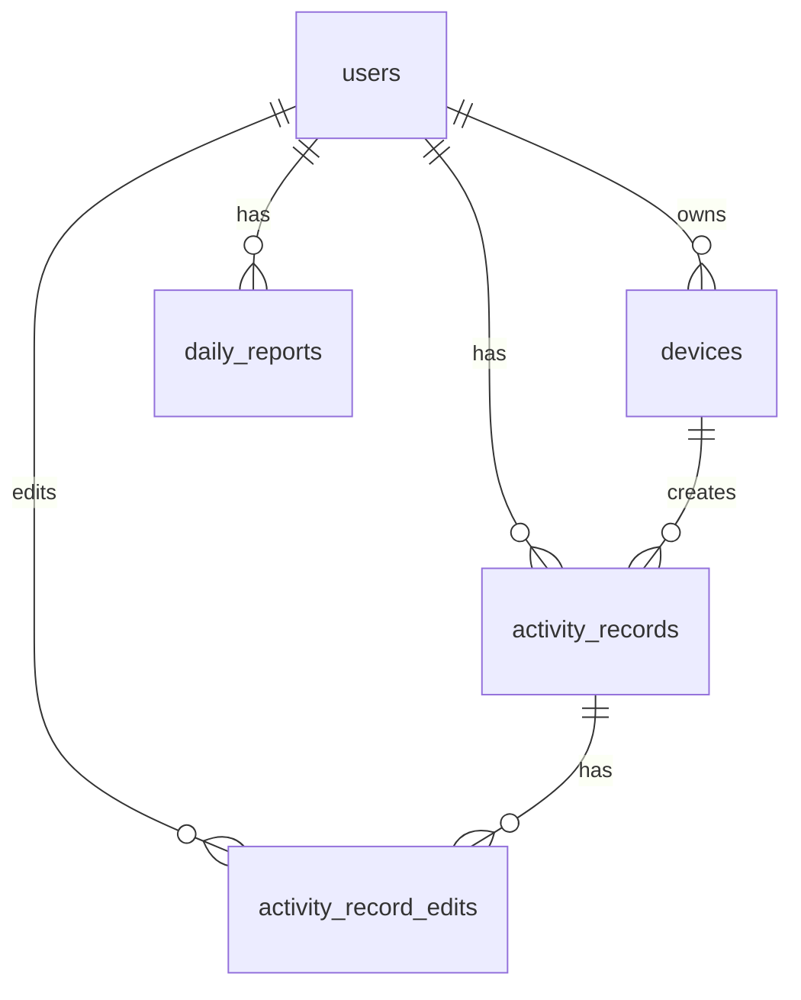

# 数据库设计（Qwen 本地摘要 + DeepSeek V4 分析版）

## 1. 文档目标

本文档描述屏幕活动记录与日报生成系统的数据库设计，包括当前服务端 SQLite 数据库、本地客户端 SQLite 数据库、字段说明、索引、唯一约束、软删除、数据保留和后续扩展设计。

系统采用双模型架构：客户端使用 Qwen3.5-0.8B 生成本地屏幕短摘要，服务端使用 DeepSeek V4 API 对结构化活动记录进行日报级深度分析。因此数据库需要同时保存本地摘要元数据、规则聚合日报、AI 分析结果、AI 任务状态和 token 成本信息。

数据库设计原则：

1. 用户数据隔离。
2. 活动记录支持时间范围查询。
3. 上传记录支持幂等去重。
4. 日报结构支持 JSON 扩展。
5. 删除操作默认软删除。
6. 本地缓存支持断网续传。
7. 默认不存储原始截图和 OCR 原文。

---

## 1.1 当前实现对齐（截至 2026-07-03）

当前代码实现使用两套 SQLite 数据库：

1. 服务端 SQLite：由 `server/app/database.py::init_db()` 创建，默认文件路径为 `data/app.db` 或环境变量 `APP_DATABASE_PATH` 指定路径。
2. 客户端 SQLite：由 `desktop-client/src/main/storage/LocalDatabase.ts` 创建，默认位于 Electron `app.getPath("userData")/data/activity_daily_client.db`。
3. 服务端当前未使用 PostgreSQL、Alembic 或 SQLAlchemy；本文档中 PostgreSQL/JSONB/TIMESTAMPTZ 风格 SQL 可视为后续生产化迁移参考，不是当前运行实现。
4. 当前已实现 `user_api_keys` 表，用于保存用户自行配置的 DeepSeek API Key 和脱敏 `key_hint`。接口不返回明文 Key；当前存储未加密，生产环境加密仍是后续增强。
5. 当前 AI 分析任务只实际支持 `analysis_type='daily'`，周报/月报字段保留为扩展字段。

---

# 2. 服务端表结构设计（当前实现为 SQLite）

当前代码通过 `server/app/database.py::init_db()` 创建 SQLite 表。下方字段说明与当前业务对象一致；若 SQL 示例出现 `UUID`、`JSONB`、`TIMESTAMPTZ` 等 PostgreSQL 类型，可视为后续生产化迁移参考，当前 SQLite 实现使用 `TEXT`、`INTEGER`、`REAL` 等类型保存。


## 2.1 ER 关系



---

## 2.2 users 表

### 建表 SQL

```sql
CREATE TABLE users (
    id UUID PRIMARY KEY,
    email VARCHAR(255) NOT NULL UNIQUE,
    username VARCHAR(100) NOT NULL,
    password_hash TEXT NOT NULL,
    timezone VARCHAR(64) NOT NULL DEFAULT 'Asia/Shanghai',
    status VARCHAR(32) NOT NULL DEFAULT 'active',
    created_at TIMESTAMP WITH TIME ZONE NOT NULL,
    updated_at TIMESTAMP WITH TIME ZONE NOT NULL,
    last_login_at TIMESTAMP WITH TIME ZONE
);
```

### 字段说明

| 字段 | 类型 | 必填 | 说明 |
|---|---|---|---|
| id | UUID | 是 | 用户 ID |
| email | VARCHAR | 是 | 登录邮箱，唯一 |
| username | VARCHAR | 是 | 用户名 |
| password_hash | TEXT | 是 | 密码哈希 |
| timezone | VARCHAR | 是 | 用户默认时区 |
| status | VARCHAR | 是 | active / disabled / deleted |
| created_at | TIMESTAMPTZ | 是 | 创建时间 |
| updated_at | TIMESTAMPTZ | 是 | 更新时间 |
| last_login_at | TIMESTAMPTZ | 否 | 最近登录时间 |

---

## 2.3 devices 表

### 建表 SQL

```sql
CREATE TABLE devices (
    id UUID PRIMARY KEY,
    user_id UUID NOT NULL REFERENCES users(id),
    device_name VARCHAR(255) NOT NULL,
    os_type VARCHAR(64) NOT NULL,
    os_version VARCHAR(128),
    client_version VARCHAR(64),
    status VARCHAR(32) NOT NULL DEFAULT 'active',
    first_seen_at TIMESTAMP WITH TIME ZONE NOT NULL,
    last_seen_at TIMESTAMP WITH TIME ZONE,
    created_at TIMESTAMP WITH TIME ZONE NOT NULL,
    updated_at TIMESTAMP WITH TIME ZONE NOT NULL
);

CREATE INDEX idx_devices_user_id ON devices(user_id);
CREATE INDEX idx_devices_status ON devices(user_id, status);
```

### 字段说明

| 字段 | 类型 | 必填 | 说明 |
|---|---|---|---|
| id | UUID | 是 | 设备 ID |
| user_id | UUID | 是 | 所属用户 |
| device_name | VARCHAR | 是 | 设备名称 |
| os_type | VARCHAR | 是 | Windows / macOS / Linux |
| os_version | VARCHAR | 否 | 系统版本 |
| client_version | VARCHAR | 否 | 客户端版本 |
| status | VARCHAR | 是 | active / disabled |
| first_seen_at | TIMESTAMPTZ | 是 | 首次注册时间 |
| last_seen_at | TIMESTAMPTZ | 否 | 最近同步时间 |
| created_at | TIMESTAMPTZ | 是 | 创建时间 |
| updated_at | TIMESTAMPTZ | 是 | 更新时间 |

---

## 2.4 activity_records 表

### 建表 SQL

```sql
CREATE TABLE activity_records (
    id UUID PRIMARY KEY,
    user_id UUID NOT NULL REFERENCES users(id),
    device_id UUID NOT NULL REFERENCES devices(id),

    client_record_id VARCHAR(128) NOT NULL,
    session_id VARCHAR(128) NOT NULL,

    start_time TIMESTAMP WITH TIME ZONE NOT NULL,
    end_time TIMESTAMP WITH TIME ZONE NOT NULL,
    duration_seconds INTEGER NOT NULL,

    app_name VARCHAR(255),
    window_title TEXT,
    process_name VARCHAR(255),

    summary TEXT NOT NULL,
    category VARCHAR(64),
    confidence DOUBLE PRECISION,

    privacy_level VARCHAR(32) NOT NULL DEFAULT 'normal',
    source VARCHAR(32) NOT NULL DEFAULT 'client',

    metadata JSONB,

    is_deleted BOOLEAN NOT NULL DEFAULT FALSE,
    deleted_at TIMESTAMP WITH TIME ZONE,

    created_at TIMESTAMP WITH TIME ZONE NOT NULL,
    updated_at TIMESTAMP WITH TIME ZONE NOT NULL,

    UNIQUE(user_id, device_id, client_record_id)
);

CREATE INDEX idx_activity_user_time
ON activity_records(user_id, start_time, end_time);

CREATE INDEX idx_activity_user_date
ON activity_records(user_id, start_time);

CREATE INDEX idx_activity_device
ON activity_records(device_id);

CREATE INDEX idx_activity_category
ON activity_records(user_id, category);

CREATE INDEX idx_activity_not_deleted
ON activity_records(user_id, start_time)
WHERE is_deleted = FALSE;
```

### 字段说明

| 字段 | 类型 | 必填 | 说明 |
|---|---|---|---|
| id | UUID | 是 | 服务端记录 ID |
| user_id | UUID | 是 | 用户 ID，来自 Token |
| device_id | UUID | 是 | 设备 ID |
| client_record_id | VARCHAR | 是 | 客户端本地记录 ID |
| session_id | VARCHAR | 是 | 客户端记录会话 ID |
| start_time | TIMESTAMPTZ | 是 | 活动开始时间 |
| end_time | TIMESTAMPTZ | 是 | 活动结束时间 |
| duration_seconds | INTEGER | 是 | 持续秒数 |
| app_name | VARCHAR | 否 | 应用名称，可由用户关闭上传 |
| window_title | TEXT | 否 | 脱敏窗口标题，默认不上传 |
| process_name | VARCHAR | 否 | 进程名 |
| summary | TEXT | 是 | 本地模型生成摘要 |
| category | VARCHAR | 否 | 活动类别 |
| confidence | DOUBLE | 否 | 模型置信度 |
| privacy_level | VARCHAR | 是 | normal / private / redacted |
| source | VARCHAR | 是 | client / manual / import |
| metadata | JSONB | 否 | 扩展信息 |
| is_deleted | BOOLEAN | 是 | 软删除标记 |
| deleted_at | TIMESTAMPTZ | 否 | 删除时间 |
| created_at | TIMESTAMPTZ | 是 | 创建时间 |
| updated_at | TIMESTAMPTZ | 是 | 更新时间 |

### metadata 示例

```json
{
  "client_version": "1.0.0",
  "model_name": "qwen3.5:0.8b",
  "model_provider": "ollama",
  "capture_mode": "active_monitor",
  "merged_from": ["local_001", "local_002"]
}
```

---

## 2.5 daily_reports 表

### 建表 SQL

```sql
CREATE TABLE daily_reports (
    id UUID PRIMARY KEY,
    user_id UUID NOT NULL REFERENCES users(id),

    report_date DATE NOT NULL,
    timezone VARCHAR(64) NOT NULL,

    title TEXT,
    overview TEXT,
    highlights JSONB,
    timeline JSONB,
    category_stats JSONB,
    app_stats JSONB,
    suggestions TEXT,
    user_note TEXT,

    total_tracked_seconds INTEGER NOT NULL DEFAULT 0,
    active_seconds INTEGER NOT NULL DEFAULT 0,
    idle_seconds INTEGER NOT NULL DEFAULT 0,
    private_seconds INTEGER NOT NULL DEFAULT 0,

    status VARCHAR(32) NOT NULL DEFAULT 'generated',
    is_stale BOOLEAN NOT NULL DEFAULT FALSE,

    generated_at TIMESTAMP WITH TIME ZONE,
    created_at TIMESTAMP WITH TIME ZONE NOT NULL,
    updated_at TIMESTAMP WITH TIME ZONE NOT NULL,

    UNIQUE(user_id, report_date)
);

CREATE INDEX idx_daily_reports_user_date
ON daily_reports(user_id, report_date);

CREATE INDEX idx_daily_reports_stale
ON daily_reports(user_id, is_stale)
WHERE is_stale = TRUE;
```

### 字段说明

| 字段 | 类型 | 必填 | 说明 |
|---|---|---|---|
| id | UUID | 是 | 日报 ID |
| user_id | UUID | 是 | 用户 ID |
| report_date | DATE | 是 | 日报日期 |
| timezone | VARCHAR | 是 | 生成日报时区 |
| title | TEXT | 否 | 一句话标题 |
| overview | TEXT | 否 | 日报概览 |
| highlights | JSONB | 否 | 今日重点 |
| timeline | JSONB | 否 | 合并后的时间线 |
| category_stats | JSONB | 否 | 分类统计 |
| app_stats | JSONB | 否 | 应用统计 |
| suggestions | TEXT | 否 | 观察建议 |
| user_note | TEXT | 否 | 用户备注 |
| total_tracked_seconds | INTEGER | 是 | 总记录秒数 |
| active_seconds | INTEGER | 是 | 有效活动秒数 |
| idle_seconds | INTEGER | 是 | 空闲秒数 |
| private_seconds | INTEGER | 是 | 隐私秒数 |
| status | VARCHAR | 是 | generating / generated / failed |
| is_stale | BOOLEAN | 是 | 是否需要重新生成 |
| generated_at | TIMESTAMPTZ | 否 | 生成时间 |
| created_at | TIMESTAMPTZ | 是 | 创建时间 |
| updated_at | TIMESTAMPTZ | 是 | 更新时间 |

### timeline JSON 结构

```json
[
  {
    "start_time": "09:00",
    "end_time": "10:20",
    "duration_seconds": 4800,
    "summary": "编写后端活动记录接口",
    "category": "编程开发",
    "app_name": "Visual Studio Code",
    "source_record_ids": ["uuid1", "uuid2"]
  }
]
```

### category_stats JSON 结构

```json
[
  {
    "category": "编程开发",
    "duration_seconds": 10800,
    "percentage": 45.0
  }
]
```

### app_stats JSON 结构

```json
[
  {
    "app_name": "Visual Studio Code",
    "duration_seconds": 9000,
    "percentage": 37.5,
    "main_activity": "编写和调试代码"
  }
]
```

---

## 2.6 activity_record_edits 表

### 建表 SQL

```sql
CREATE TABLE activity_record_edits (
    id UUID PRIMARY KEY,
    activity_record_id UUID NOT NULL REFERENCES activity_records(id),
    user_id UUID NOT NULL REFERENCES users(id),

    old_summary TEXT,
    new_summary TEXT,
    old_category VARCHAR(64),
    new_category VARCHAR(64),
    old_start_time TIMESTAMP WITH TIME ZONE,
    new_start_time TIMESTAMP WITH TIME ZONE,
    old_end_time TIMESTAMP WITH TIME ZONE,
    new_end_time TIMESTAMP WITH TIME ZONE,

    edit_reason TEXT,
    created_at TIMESTAMP WITH TIME ZONE NOT NULL
);

CREATE INDEX idx_activity_record_edits_record
ON activity_record_edits(activity_record_id);

CREATE INDEX idx_activity_record_edits_user_time
ON activity_record_edits(user_id, created_at);
```

---

## 2.7 user_settings 表

### 建表 SQL

```sql
CREATE TABLE user_settings (
    id UUID PRIMARY KEY,
    user_id UUID NOT NULL REFERENCES users(id),
    key VARCHAR(128) NOT NULL,
    value JSONB NOT NULL,
    created_at TIMESTAMP WITH TIME ZONE NOT NULL,
    updated_at TIMESTAMP WITH TIME ZONE NOT NULL,
    UNIQUE(user_id, key)
);
```

### 示例 value

```json
{
  "capture_interval_seconds": 30,
  "idle_threshold_seconds": 300,
  "upload_window_title": false,
  "upload_raw_screenshot": false,
  "upload_ocr_text": false,
  "privacy_app_blacklist": ["1Password", "Bitwarden"],
  "privacy_keywords": ["密码", "验证码", "身份证", "银行卡"]
}
```

---

# 3. 本地 SQLite 设计

## 3.1 local_activity_records

```sql
CREATE TABLE local_activity_records (
    id TEXT PRIMARY KEY,
    user_id TEXT,
    device_id TEXT NOT NULL,
    session_id TEXT NOT NULL,

    start_time TEXT NOT NULL,
    end_time TEXT NOT NULL,
    duration_seconds INTEGER NOT NULL,

    app_name TEXT,
    window_title TEXT,
    process_name TEXT,

    summary TEXT NOT NULL,
    category TEXT,
    confidence REAL,

    privacy_level TEXT NOT NULL DEFAULT 'normal',
    upload_status TEXT NOT NULL DEFAULT 'pending',
    retry_count INTEGER NOT NULL DEFAULT 0,

    server_record_id TEXT,
    error_message TEXT,
    metadata TEXT,

    created_at TEXT NOT NULL,
    updated_at TEXT NOT NULL
);

CREATE INDEX idx_local_activity_upload_status
ON local_activity_records(upload_status);

CREATE INDEX idx_local_activity_time
ON local_activity_records(start_time, end_time);

CREATE INDEX idx_local_activity_session
ON local_activity_records(session_id);
```

---

## 3.2 local_sessions

```sql
CREATE TABLE local_sessions (
    id TEXT PRIMARY KEY,
    device_id TEXT NOT NULL,
    started_at TEXT NOT NULL,
    ended_at TEXT,
    status TEXT NOT NULL,
    created_at TEXT NOT NULL,
    updated_at TEXT NOT NULL
);
```

---

## 3.3 local_settings

```sql
CREATE TABLE local_settings (
    key TEXT PRIMARY KEY,
    value TEXT NOT NULL,
    updated_at TEXT NOT NULL
);
```

---

## 3.4 local_sync_logs

```sql
CREATE TABLE local_sync_logs (
    id TEXT PRIMARY KEY,
    started_at TEXT NOT NULL,
    ended_at TEXT,
    status TEXT NOT NULL,
    uploaded_count INTEGER DEFAULT 0,
    failed_count INTEGER DEFAULT 0,
    error_message TEXT
);
```

---

# 4. 枚举设计


---

## 3.6 ai_analysis_jobs 表

表名：`ai_analysis_jobs`

用途：记录 DeepSeek V4 API 分析任务的执行状态、输入摘要 hash、输出结果和成本信息。

```sql
CREATE TABLE ai_analysis_jobs (
    id UUID PRIMARY KEY,
    user_id UUID NOT NULL REFERENCES users(id),
    report_id UUID REFERENCES daily_reports(id),

    analysis_type VARCHAR(32) NOT NULL DEFAULT 'daily',
    report_date DATE,
    date_range_start DATE,
    date_range_end DATE,

    status VARCHAR(32) NOT NULL DEFAULT 'pending',
    mode VARCHAR(32) NOT NULL DEFAULT 'standard',

    model_provider VARCHAR(64) NOT NULL DEFAULT 'deepseek',
    model_name VARCHAR(128) NOT NULL DEFAULT 'deepseek-v4-flash',
    model_version VARCHAR(128),

    input_hash VARCHAR(128) NOT NULL,
    prompt_version VARCHAR(64) NOT NULL,
    sanitized_payload JSONB,
    analysis_result JSONB,

    input_tokens INTEGER DEFAULT 0,
    output_tokens INTEGER DEFAULT 0,
    total_tokens INTEGER DEFAULT 0,
    estimated_cost NUMERIC(12, 6),

    error_code VARCHAR(128),
    error_message TEXT,
    retry_count INTEGER NOT NULL DEFAULT 0,

    started_at TIMESTAMP WITH TIME ZONE,
    finished_at TIMESTAMP WITH TIME ZONE,
    created_at TIMESTAMP WITH TIME ZONE NOT NULL,
    updated_at TIMESTAMP WITH TIME ZONE NOT NULL
);

CREATE INDEX idx_ai_jobs_user_date
ON ai_analysis_jobs(user_id, report_date);

CREATE INDEX idx_ai_jobs_status
ON ai_analysis_jobs(status);

CREATE INDEX idx_ai_jobs_input_hash
ON ai_analysis_jobs(user_id, analysis_type, input_hash);
```

字段说明：

| 字段 | 说明 |
|---|---|
| analysis_type | daily / weekly / monthly，MVP 先支持 daily |
| mode | standard / deep，standard 默认 flash，deep 可使用 pro |
| model_provider | 固定为 deepseek，后续可扩展其他云端模型 |
| model_name | deepseek-v4-flash 或 deepseek-v4-pro |
| input_hash | 脱敏输入的 hash，用于缓存和避免重复调用 |
| prompt_version | Prompt 模板版本，便于后续迭代 |
| sanitized_payload | 发给 DeepSeek 前的脱敏结构化输入，可根据隐私策略选择是否保存 |
| analysis_result | DeepSeek 返回并解析后的 JSON 结果 |
| input_tokens/output_tokens | token 使用量，用于成本统计 |
| estimated_cost | 估算调用成本 |

---

## 3.7 ai_analysis_token_usage 表

表名：`ai_analysis_token_usage`

用途：按用户、日期、模型记录 DeepSeek API 使用量，便于限流、计费和成本控制。

```sql
CREATE TABLE ai_analysis_token_usage (
    id UUID PRIMARY KEY,
    user_id UUID NOT NULL REFERENCES users(id),
    job_id UUID REFERENCES ai_analysis_jobs(id),

    usage_date DATE NOT NULL,
    model_provider VARCHAR(64) NOT NULL DEFAULT 'deepseek',
    model_name VARCHAR(128) NOT NULL,

    input_tokens INTEGER NOT NULL DEFAULT 0,
    output_tokens INTEGER NOT NULL DEFAULT 0,
    total_tokens INTEGER NOT NULL DEFAULT 0,
    estimated_cost NUMERIC(12, 6),

    created_at TIMESTAMP WITH TIME ZONE NOT NULL
);

CREATE INDEX idx_ai_usage_user_date
ON ai_analysis_token_usage(user_id, usage_date);

CREATE INDEX idx_ai_usage_model
ON ai_analysis_token_usage(model_provider, model_name);
```

---

## 3.7.1 user_api_keys 表（当前已实现）

表名：`user_api_keys`

用途：保存用户自行配置的 DeepSeek API Key。当前接口只返回 `configured` 和 `key_hint`，不返回明文 Key。当前 MVP 为 SQLite 明文存储，生产环境应改为加密存储或接入密钥管理服务。

```sql
CREATE TABLE IF NOT EXISTS user_api_keys (
    user_id TEXT NOT NULL REFERENCES users(id),
    provider TEXT NOT NULL,
    api_key TEXT NOT NULL,
    key_hint TEXT,
    created_at TEXT NOT NULL,
    updated_at TEXT NOT NULL,
    PRIMARY KEY (user_id, provider)
);
CREATE INDEX IF NOT EXISTS idx_user_api_keys_provider ON user_api_keys(provider);
```

字段说明：

| 字段 | 说明 |
|---|---|
| user_id | 所属用户 ID |
| provider | 当前为 `deepseek` |
| api_key | 用户提交的 API Key；当前 MVP 未加密 |
| key_hint | 脱敏展示，例如 `sk-xxx...abcd` |
| created_at / updated_at | 创建和更新时间 |

---
## 3.8 daily_reports 表新增 AI 字段建议

如果希望日报表直接保存最近一次 AI 分析结果，可在 `daily_reports` 中增加以下字段：

```sql
ALTER TABLE daily_reports
ADD COLUMN ai_analysis_status VARCHAR(32) DEFAULT 'none',
ADD COLUMN ai_analysis_job_id UUID REFERENCES ai_analysis_jobs(id),
ADD COLUMN ai_title TEXT,
ADD COLUMN ai_summary TEXT,
ADD COLUMN ai_highlights JSONB,
ADD COLUMN ai_timeline_commentary JSONB,
ADD COLUMN ai_focus_analysis JSONB,
ADD COLUMN ai_suggestions JSONB,
ADD COLUMN ai_risk_flags JSONB,
ADD COLUMN ai_model_name VARCHAR(128),
ADD COLUMN ai_generated_at TIMESTAMP WITH TIME ZONE;
```

两种存储方案：

| 方案 | 说明 | 优点 | 缺点 |
|---|---|---|---|
| 只存 ai_analysis_jobs | daily_reports 不冗余 AI 内容 | 结构清晰，历史可追踪 | 查询日报时需要 join |
| daily_reports 冗余最新 AI 结果 | 同时保留 ai_analysis_jobs 历史 | 查询快，前端简单 | 字段较多，有冗余 |

MVP 推荐：`ai_analysis_jobs` 保存完整历史，`daily_reports` 冗余最近一次成功分析结果。

## 4.1 activity category

```text
编程开发
文档写作
论文阅读
数据分析
模型训练
会议沟通
信息检索
娱乐休息
系统操作
空闲
隐私
其他
```

## 4.2 privacy_level

```text
normal     普通记录
private    隐私时间段
redacted   已脱敏记录
```

## 4.3 upload_status

```text
pending    待上传
uploading  上传中
synced     已同步
failed     上传失败
ignored    用户选择不上传
```

## 4.4 report status

```text
generating 生成中
generated  已生成
failed     生成失败
```

---

# 5. 索引设计原则

## 5.1 活动记录查询

主要查询模式：

1. 按用户和日期查询。
2. 按用户和时间范围查询。
3. 按设备过滤。
4. 按类别统计。
5. 排除已删除记录。

核心索引：

```sql
CREATE INDEX idx_activity_user_time
ON activity_records(user_id, start_time, end_time);

CREATE INDEX idx_activity_not_deleted
ON activity_records(user_id, start_time)
WHERE is_deleted = FALSE;
```

## 5.2 日报查询

主要查询模式：

1. 用户查询某日。
2. 查询 stale 报告。

核心索引：

```sql
CREATE INDEX idx_daily_reports_user_date
ON daily_reports(user_id, report_date);

CREATE INDEX idx_daily_reports_stale
ON daily_reports(user_id, is_stale)
WHERE is_stale = TRUE;
```

---

# 6. 幂等设计

活动记录上传必须幂等。

唯一约束：

```sql
UNIQUE(user_id, device_id, client_record_id)
```

客户端重复上传同一条记录时，服务端应返回 duplicated，而不是创建新记录。

---

# 7. 软删除策略

活动记录默认软删除：

```sql
UPDATE activity_records
SET is_deleted = TRUE,
    deleted_at = NOW(),
    updated_at = NOW()
WHERE id = :record_id
  AND user_id = :user_id;
```

软删除后：

1. 默认查询不返回。
2. 日报重新生成时不参与统计。
3. 可保留编辑审计。
4. 用户请求彻底删除账号时执行物理删除。

---

# 8. 数据保留策略

默认建议：

| 数据 | 保留策略 |
|---|---|
| 活动摘要 | 用户手动删除前保留 |
| 日报 | 用户手动删除前保留 |
| 本地已同步缓存 | 可配置自动清理，默认保留 30 天 |
| 本地截图 | 默认不保存 |
| OCR 原文 | 默认不保存 |
| 日志 | 默认保留 7 到 30 天 |

---

# 9. 数据迁移策略

当前 MVP 使用 `server/app/database.py::init_db()` 在启动时创建和补齐 SQLite 表结构；Alembic 尚未接入，后续迁移到 PostgreSQL 时再引入。

要求：

1. 每次表结构变更生成迁移脚本。
2. 迁移脚本必须支持升级和回滚。
3. 生产迁移前先备份数据库。
4. 大字段变更应避免长时间锁表。

---

# 10. 隐私字段约束

默认不设计以下字段进入服务端 activity_records：

1. raw_screenshot。
2. image_base64。
3. ocr_text。
4. keyboard_input。
5. mouse_trace。
6. audio。
7. camera。

如未来支持原始截图上传，必须单独建表、单独授权、单独加密、单独生命周期管理。

---

# 11. 验收标准

1. 当前 SQLite 表结构可以通过 `init_db()` 创建；PostgreSQL 迁移脚本属于后续生产化工作。
2. 用户、设备、活动记录、日报关系正确。
3. 活动记录上传支持唯一约束去重。
4. 按日期查询活动记录性能可接受。
5. 日报 JSON 字段可以完整保存时间线和统计数据。
6. 删除记录后默认查询不返回。
7. 日报重新生成不统计已删除记录。
8. 本地 SQLite 支持 pending、synced、failed 状态流转。
9. 默认不存储原始截图和 OCR 原文。
10. 数据库字段支持记录 Qwen3.5-0.8B 的本地模型元数据。
11. 数据库字段支持保存 DeepSeek V4 API 分析任务、分析结果、token 使用量和成本估算。
